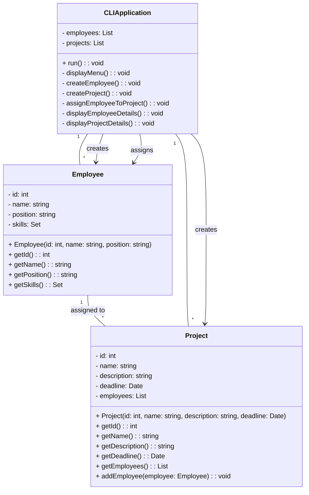

```mermaid
classDiagram
    class Employee {
        - id: int
        - name: string
        - position: string
        - skills: Set<string>
        + Employee(id: int, name: string, position: string)
        + getId(): int
        + getName(): string
        + getPosition(): string
        + getSkills(): Set<string>
    }

    class Project {
        - id: int
        - name: string
        - description: string
        - deadline: Date
        - employees: List<Employee>
        + Project(id: int, name: string, description: string, deadline: Date)
        + getId(): int
        + getName(): string
        + getDescription(): string
        + getDeadline(): Date
        + getEmployees(): List<Employee>
        + addEmployee(employee: Employee): void
    }

    class CLIApplication {
        - employees: List<Employee>
        - projects: List<Project>
        + run(): void
        - displayMenu(): void
        - createEmployee(): void
        - createProject(): void
        - assignEmployeeToProject(): void
        - displayEmployeeDetails(): void
        - displayProjectDetails(): void
    }

    Employee "1" -- "*" Project: assigned to
    CLIApplication "1" -- "*" Employee
    CLIApplication "1" -- "*" Project

    CLIApplication --> Employee: creates
    CLIApplication --> Project: creates
    CLIApplication --> Employee: assigns
```