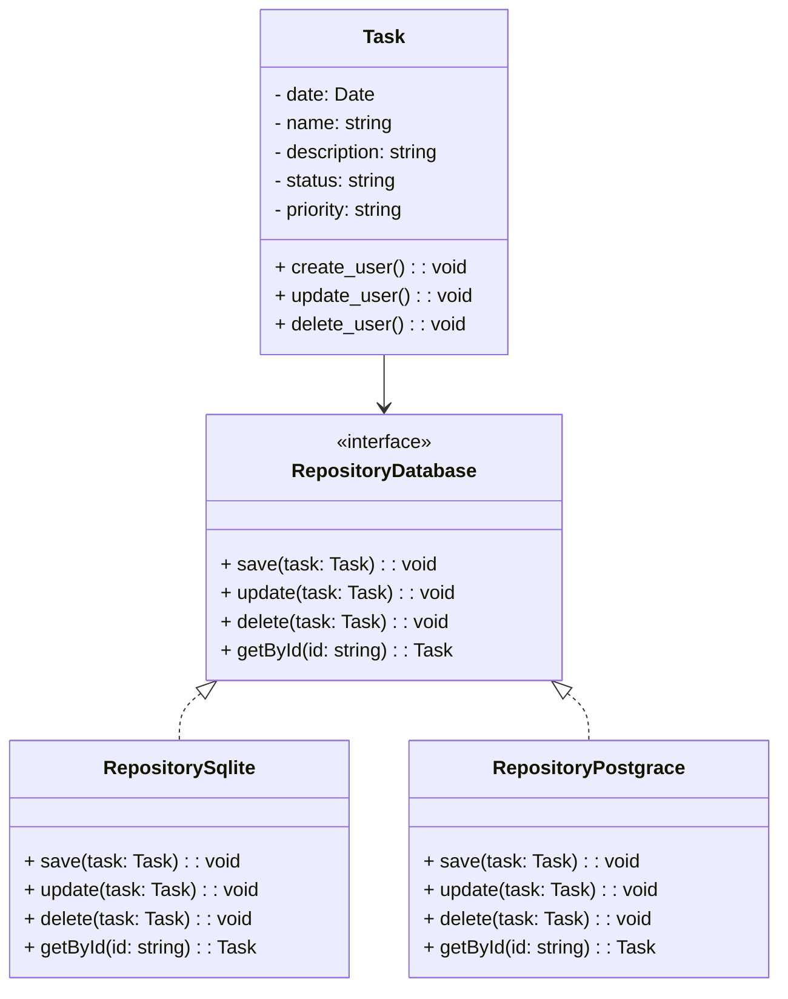

```mermaid
classDiagram
    class Task {
        - date: Date
        - name: string
        - description: string
        - status: string
        - priority: string
        + create_user(): void
        + update_user(): void
        + delete_user(): void
    }
    
    class RepositoryDatabase {
        <<interface>>
        + save(task: Task): void
        + update(task: Task): void
        + delete(task: Task): void
        + getById(id: string): Task
    }
    
    class RepositorySqlite {
        + save(task: Task): void
        + update(task: Task): void
        + delete(task: Task): void
        + getById(id: string): Task
    }
    
    class RepositoryPostgrace {
        + save(task: Task): void
        + update(task: Task): void
        + delete(task: Task): void
        + getById(id: string): Task
    }
    
    Task --> RepositoryDatabase
    RepositoryDatabase <|.. RepositorySqlite
    RepositoryDatabase <|.. RepositoryPostgrace
```