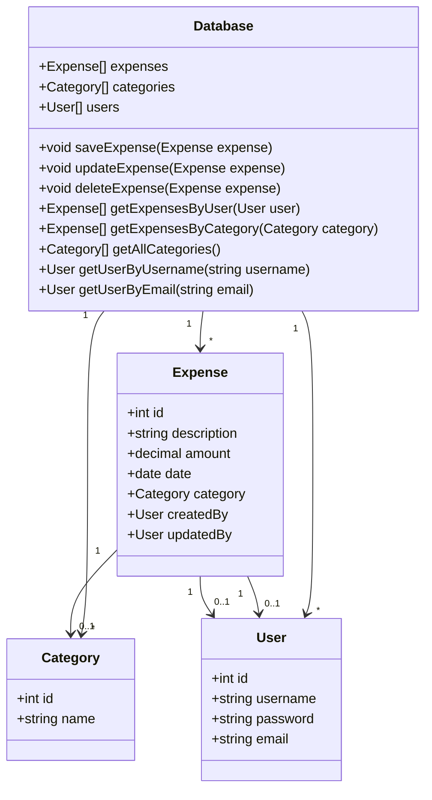

```mermaid
classDiagram
    class Expense {
        +int id
        +string description
        +decimal amount
        +date date
        +Category category
        +User createdBy
        +User updatedBy
    }

    class Category {
        +int id
        +string name
    }

    class User {
        +int id
        +string username
        +string password
        +string email
    }

    class Database {
        +Expense[] expenses
        +Category[] categories
        +User[] users
        +void saveExpense(Expense expense)
        +void updateExpense(Expense expense)
        +void deleteExpense(Expense expense)
        +Expense[] getExpensesByUser(User user)
        +Expense[] getExpensesByCategory(Category category)
        +Category[] getAllCategories()
        +User getUserByUsername(string username)
        +User getUserByEmail(string email)
    }

    Expense "1" --> "0..1" Category
    Expense "1" --> "0..1" User
    Expense "1" --> "0..1" User
    Database "1" --> "*" Expense
    Database "1" --> "*" Category
    Database "1" --> "*" User
```